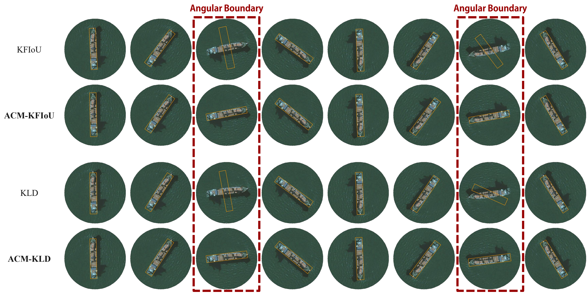

<div align="center">

# <b>Rethinking Boundary Discontinuity Problem for Oriented Object Detection

[Hang Xu](https://hangxu-cv.github.io/)<sup>1*</sup>, [Xinyuan Liu](https://antxinyuan.github.io/)<sup>2*</sup>, [Haonan Xu](https://scholar.google.com/citations?user=Up_a2VAAAAAJ&hl=zh-CN)<sup>2</sup>, [Yike Ma](http://www.ict.cas.cn/sourcedb_ict_cas/cn/jssrck/201511/t20151119_4470413.html)<sup>2</sup>, [Zunjie Zhu](http://iipl.net.cn/index/team_details/id/129.aspx)<sup>1</sup>, [Chenggang Yan](https://cgyan-iipl.github.io/)<sup>1</sup>, [Feng Dai](http://www.ict.cas.cn/sourcedb_ict_cas/cn/jssrck/201404/t20140422_4096774.html)<sup>2†</sup>

<p><sup>1</sup>Hangzhou Dianzi University &nbsp;&nbsp;<sup>2</sup>Institute of Computing Technology, Chinese Academy of Sciences
<br><sup>*</sup>Equal contribution &nbsp;&nbsp;<sup>&dagger;</sup>Corresponding author<p>

### [Projectpage]() · [Paper](https://arxiv.org/abs/2305.10061) · [Video]()

</div>

## :fire: News
- **[03/20/2024]** Full code released.
- **[02/27/2024]** This paper is accepted by CVPR 2024.

## Introduction
Oriented object detection has been developed rapidly in the past few years, where rotation equivariance is crucial for detectors to predict rotated boxes. It is expected that the prediction can maintain the corresponding rotation when objects rotate, but severe mutation in angular prediction is sometimes observed when objects rotate near the boundary angle, which is well-known boundary discontinuity problem. The problem has been long believed to be caused by the sharp loss increase at the angular boundary, and widely used joint-optim IoU-like methods deal with this problem by loss-smoothing. However, we experimentally find that even state-of-the-art IoU-like methods actually fail to solve the problem. On further analysis, we find that the key to solution lies in encoding mode of the smoothing function rather than in joint or independent optimization. In existing IoU-like methods, the model essentially attempts to fit the angular relationship between box and object, where the break point at angular boundary makes the predictions highly unstable.To deal with this issue, we propose a dual-optimization paradigm for angles. We decouple reversibility and joint-optim from single smoothing function into two distinct entities, which for the first time achieves the objectives of both correcting angular boundary and blending angle with other parameters.Extensive experiments on multiple datasets show that boundary discontinuity problem is well-addressed. Moreover, typical IoU-like methods are improved to the same level without obvious performance gap.


## Installation
> This repository is developed based on TGRS22 paper GF-CSL 's [offical code](https://github.com/WangJian981002/GF-CSL), which contains a CenterNet detector with minimalism style. By the way, some loss functions and modules are modified based on [mmdet](https://github.com/open-mmlab/mmdet) and [mmrotate](https://github.com/open-mmlab/mmrotate).

### Requirements
* Linux
* Python 3.7+
* Pytorch 1.7.0 or higher
* mmcv
* CUDA 11.0
* GCC 7.5.0

####  INSTALL
1. Create a conda virtual environment and activate it

```
conda create -n cvpr24acm python=3.7 -y
conda activate cvpr24acm
```

2. Install PyTorch and torchvision following the [official instructions](https://pytorch.org/), e.g.

`conda install pytorch==1.7.1 torchvision==0.8.2 torchaudio==0.7.2 cudatoolkit=11.0 -c pytorch`

3. Install [mmcv](https://github.com/open-mmlab/mmcv) for DCNv2, e.g.

```
#pip install mmcv-full -f https://download.openmmlab.com/mmcv/dist/{cu_version}/{torch_version}/index.html
pip install mmcv-full -f https://download.openmmlab.com/mmcv/dist/cu110/torch1.7.1/index.html
```

4. Install DOTA_devkit

```
sudo apt-get install swig
cd DOTA_devkit
swig -c++ -python polyiou.i
python setup.py build_ext --inplace
```

### Dataset Preparation
For DOTA datasets, please refer [DOTA_devkit](https://github.com/CAPTAIN-WHU/DOTA_devkit) to crop the original images into patches. e.g. 1024×1024 pixels with overlap 256 px.

Please organize the datasets in the following format. Note that the test set of DOTA does not provide annotations, so you can place the corresponding empty files in the test_split/labelTxt path.

As described in the paper, we use a relatively large image resolution during the test, please crop the test image into a 4000×4000 px with overlap 2000 px.
 
```
cvpr24acm
├── DOTA_devkit
│   ├── datasets
│   │   ├── DOTA
│   │   │   ├── trainvalsplit-1024-256
│   │   │   │   ├── images
│   │   │   │   ├── labelTxt
│   │   │   ├── trainvalsplit-multiscale
│   │   │   │   ├── images
│   │   │   │   ├── labelTxt
│   │   │   │── test4000
│   │   │   │   ├── images
│   │   │   │   ├── labelTxt
│   │   │── HRSC2016
│   │   │   │── train
│   │   │   │   ├── images
│   │   │   │   ├── labelTxt
│   │   │   │── test
│   │   │   │   ├── images
│   │   │   │   ├── labelTxt
│   │   │── UCAS_AOD
│   │   │   │── train
│   │   │   │   ├── images
│   │   │   │   ├── labelTxt
│   │   │   │── test
│   │   │   │   ├── images
│   │   │   │   ├── labelTxt
```

for each annotation file (.txt), each line represent an object following:

x1, y1, x2, y2, x3, y3, x4, y4, class, difficult

```
e.g.:
2753 2408 2861 2385 2888 2468 2805 2502 plane 0
3445 3391 3484 3409 3478 3422 3437 3402 large-vehicle 0
3185 4158 3195 4161 3175 4204 3164 4199 large-vehicle 0
2870 4250 2916 4268 2912 4283 2866 4263 large-vehicle 0
630 1674 628 1666 640 1654 644 1666 small-vehicle 0
636 1713 633 1706 646 1698 650 1706 small-vehicle 0
717 76 726 78 722 95 714 90 small-vehicle 0
737 82 744 84 739 101 731 98 small-vehicle 0
...
```

### Training
For example, using 2 GPUs to training a ResNet50 model:
```
#DOTA
CUDA_VISIBLE_DEVICES=0,1 python train_dota.py --datadir ./DOTA_devkit/datasets/DOTA/trainvalsplit-1024-256 --model 50 
#HRSC2016
CUDA_VISIBLE_DEVICES=0,1 python train_hrsc.py --datadir ./DOTA_devkit/datasets/HRSC2016/train --model 50 --input_size 640
#UCAS-AOD
CUDA_VISIBLE_DEVICES=0,1 python train_ucas.py --datadir ./DOTA_devkit/datasets/UCAS_AOD/train --model 50 --input_size 640
```
`--input_size ` is the long side resolution during training,  which must be divisible by 32.

### Testing

For DOTA dataset:
```
# Single scale testing
python evaluate.py --operation DOTA_test \
    --model 50 --weight_path ./checkpoint/r50-scale=[0.5.1.0].pth \
    --test_size 4000 --output_id 0
```
The results files will appear at "./result/test0/test0_final", which can be subsequently sent to the [DOTA server](http://bed4rs.net:8001/login/) to obtain the evaluation results.
```
# Multiscale scale testing
python evaluate.py --operation DOTA_MS_test \
    --model 50 --weight_path ./checkpoint/r50-scale=[0.5.1.0].pth \
    --test_image_dir ./DOTA_devkit/datasets/DOTA/test4000/images
```
The results files will appear at "./result/test/test_final"

For HRSC2016 or UCAS-AOD dataset:
```
# Single scale testing
python evaluate.py --operation HRSC_test \
    --model 50 --weight_path ${WEIGHT_PATH} \
    --hrsc_test_size 640 
```
```
# Multiscale scale testing
python evaluate.py --operation HRSC_MS_test \
    --model 50 --weight_path ${WEIGHT_PATH} 
```

### Visualize
For example, using pretrained ResNet50 model:
```
python evaluate.py --operation visualize \
    --model 50 --weight_path ./checkpoint/r50-scale=[0.5.1.0].pth \
    --img_path ./result/P0007.png
```

Optional arguments:
* --score_thr :object confidence during detection. score greater than the confidence is considered to be a detected object.

The visualization file appears in the current path as demo.jpg.

### More details
To configure the model more finely in training/testing/visualizing, you can add some extra configuration items, e.g.
```
CUDA_VISIBLE_DEVICES=0,1 python train_dota.py \
	        --heads 15 \
	        --model 50 \
			--coder acm \
            --coder_cfg 1 \
            --coder_mode model \
            --box_loss riou
```
- heads: the number of classification headers, corresponding to the number of data set categories.
- model: the version of ResNet backbone, e.g. 18 / 34 / 50 / 101 / 152
- coder: the type of angle coder, e.g. none / acm / psc / csl
- coder_cfg: the config of angle coder,

        for acm, coder_cfg >= 0 indicates that dual_freq=True.

        for psc, coder_cfg indicates the umber of phase steps.

        for csl, coder_cfg indicates the umber of encoding length.
- coder_mode: coder mode, e.g. model / loss, where model indicates model outputs encoding while loss indicates model ouputs anlge itself.
- box_loss: loss for box, e.g. none / kld / gwd / kfiou / riou.

## Citation

If you find this code useful for your research, please consider citing:
```
@inproceedings{xucvpr24acm,
author = {Xu, Hang and Liu, Xinyuan and Xu, Haonan and Ma, Yike and Zhu, Zunjie and Yan, Chenggang and Dai, Feng},
title = {Rethinking Boundary Discontinuity Problem for Oriented Object Detection},
booktitle = {IEEE/CVF Conference on Computer Vision and Pattern Recognition},
year = {2024},
}
```
